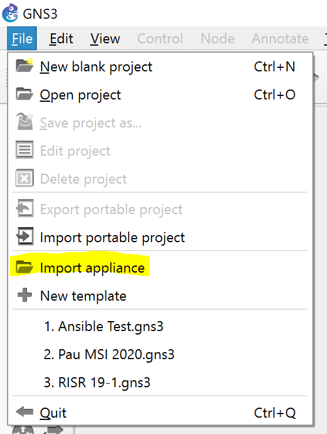
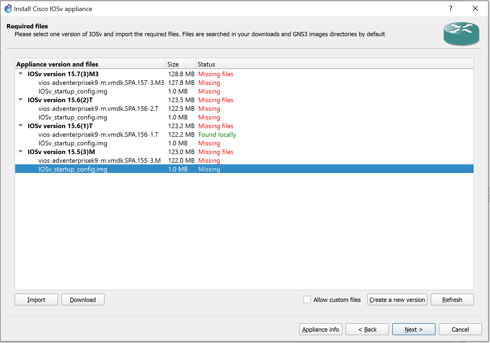
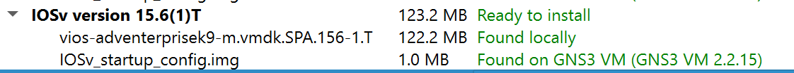
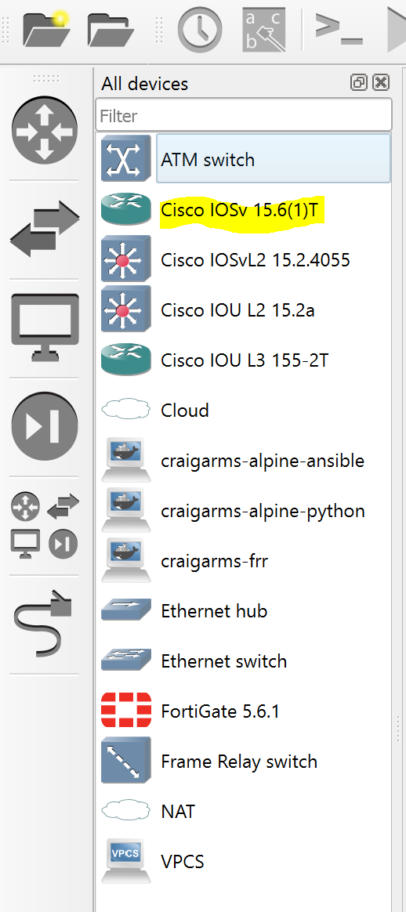

# Images de simulation

Quelque soit l'outil de labbing que l'on utilise, on doit s'assurer d'avoir les *images* ou binaires équivalent aux plateformes de l'on souhaite emuler. Plusieurs format existent. Ci-dessous on passe en revue les différents formats ainsi que leurs avantages et inconvénients.

## IOSv

Les VM IOSv sont des versions officiellement distribué par Cisco afin de créer des lab de simulation d'environement réel. L'avantage de ces IOSv c'est qu'ils sont supportés et tenus à jours par Cisco.

L'inconvénient c'est que ce sont des machines virtuel qui requièrent une quantité non-négligeable de RAM et vCPU.

Créer un Lab entièrement avec des IOSv nécessitera une puissance assez élevé et donc sera réservé pour des outils de simulation déployés sur des serveurs ou PC haute performances.

On préfèrera coupler l'IOSv avec d'autre technologies d'émulation comme IOL ou les conteneurs afin de maximiser les tailles de lab tout en permettant de les lancer sur des PC de travail.

### Téléchargement

Les IOSv se téléchargent sur le site de [VIRL](https://learningnetworkstore.cisco.com/myaccount) et nécessite d'avoir effectuer l'achat de Cisco VIRL.

Pour la Lab de ce TP on utilisera les versions suivantes:
 * Routeurs: vios-adventerprisek9-m.vmdk.SPA.156-2.T
 * Switches: vios_l2-adventerprisek9-m.vmdk.SSA.152-4.0.55.E
 
### Installation

#### GNS3

Pour utiliser un IOSv (ou VIOS) sous GNS3 il faut avoir déployé un serveur GNS3 ayant le support KVM (hyperviseur de VM Linux).

Dans les grandes lignes:
 * Copie de l'image vers le serveur dans le dossier /opt/gns3/images/QEMU/
 * Déclaration de l'image sur le serveur
 
GNS3 fourni une interface intuitive afin d'effectuer ces étapes en plus de contenir des informations de configuration, **l'import d'appliance**

Les *appliances* au sens GNS3 sont des fichiers de type JSON portant l'extension *.gns3a. Vous pourrez trouver toutes les appliances *basiques* dans le repertoirs d'installation de GNS3. (Par défaut C:\Program Files\GNS3\appliances)

Sélectionnez l'appliance **cisco-iosv.gns3a** pour déployer le routeur vers le serveur/VM GNS3; et **cisco-iosvl2.gns3a** pour le switch.

Suivez le wizard et laisser les options par défaut. Pointez l'utilitaire vers les fichiers de la version que vous souhaitez déployer en cliquant sur *Import*

Quand tous les fichiers pour une version sont mis à disposition de GNS3 la version passera en *Ready to install*

Les fichiers seront transférés vers le serveur/VM GNS3 et mis à disposition dans le client lourd pour ajout à un projet.

#### EVE-NG

Pour déployer les IOSv sur EVE-NG il faudra télécharger les IOSv au format QCOW2 ou bien les convertir sur le serveur en suivant le [How to sur le site d'EVE-NG](https://www.eve-ng.net/index.php/documentation/howtos/howto-add-cisco-vios-from-virl/)

## IOL

IOL ou IOS On Linux, aussi appelé IOU ou IOS on Unix. IOL est un binaire executable disponible seulement pour les employés Cisco ainsi que les partenaires autorisés.

IOL fait référence à la version Linux compilé pour les architectures de processeur x86 alors que IOU fait référence à la version Solaris pour processeurs SPARC.

Etant des binaires et non des VM, l'IOL permet une plus grande scalabilité des Labs avec des ressources systèmes limité.

Par contre, vue que ce ne sont que des versions interne de dévelopement, les binaires IOL souffrent de bug et de features non-fonctionnel.

On les couplera donc avec des VM de type IOSv (IOSv, CSRv, ISRv) afin de profiter de leurs features.

Pour les lab de ce TP on utilisera les versions:
 * Routeurs: i86bi-linux-l3-adventerprisek9-15.5.2T.bin
 * Switches: i86bi-linux-l2-adventerprisek9-15.2a.bin
 
### Installation

#### GNS3

#### EVE-NG

Pour déployer les IOL sur EVE-NG il faudra les télécharger sur le serveur en suivant le [How to sur le site d'EVE-NG](https://www.eve-ng.net/index.php/documentation/howtos/howto-add-cisco-iol-ios-on-linux/)

## Fortigate

## FRRouting

## Open vSwitch