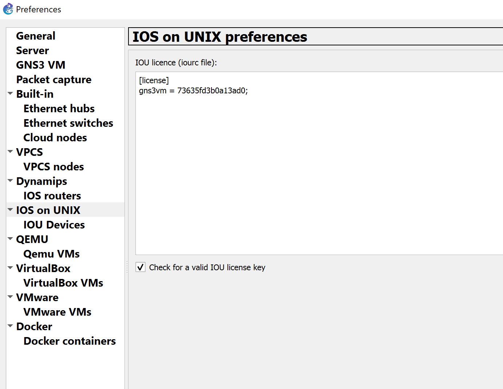
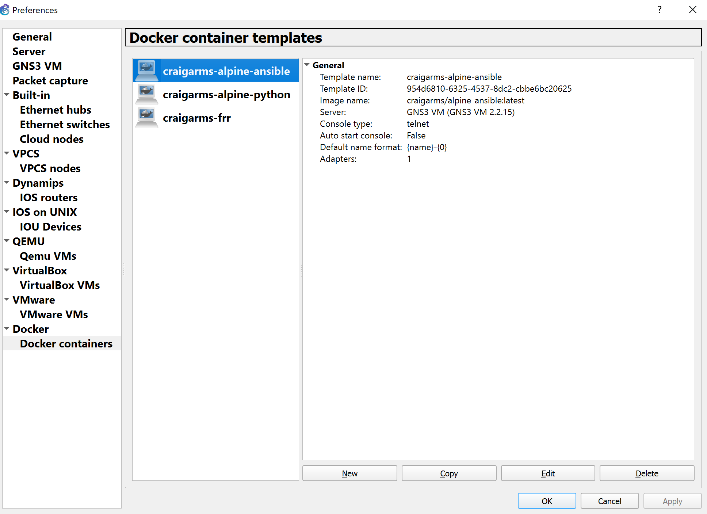

# Images de simulation

Quelque soit l'outil de labbing que l'on utilise, on doit s'assurer d'avoir les *images* ou binaires équivalent aux plateformes de l'on souhaite emuler. Plusieurs format existent. Ci-dessous on passe en revue les différents formats ainsi que leurs avantages et inconvénients.

## IOSv

Les VM IOSv sont des versions officiellement distribué par Cisco afin de créer des lab de simulation d'environement réel. L'avantage de ces IOSv c'est qu'ils sont supportés et tenus à jours par Cisco.

L'inconvénient c'est que ce sont des machines virtuel qui requièrent une quantité non-négligeable de RAM et vCPU.

Créer un Lab entièrement avec des IOSv nécessitera une puissance assez élevé et donc sera réservé pour des outils de simulation déployés sur des serveurs ou PC haute performances.

On préfèrera coupler l'IOSv avec d'autre technologies d'émulation comme IOL ou les conteneurs afin de maximiser les tailles de lab tout en permettant de les lancer sur des PC de travail.

### Téléchargement

Les IOSv se téléchargent sur le site de [VIRL](https://learningnetworkstore.cisco.com/myaccount) et nécessite d'avoir effectuer l'achat de Cisco VIRL.

Pour la Lab de ce TP on utilisera les versions suivantes:
 * Routeurs: vios-adventerprisek9-m.vmdk.SPA.156-2.T
 * Switches: vios_l2-adventerprisek9-m.vmdk.SSA.152-4.0.55.E
 
### Installation

#### GNS3

Pour utiliser un IOSv (ou VIOS) sous GNS3 il faut avoir déployé un serveur GNS3 ayant le support KVM (hyperviseur de VM Linux).

Dans les grandes lignes:
 * Copie de l'image vers le serveur dans le dossier /opt/gns3/images/QEMU/
 * Déclaration de l'image sur le serveur
 
GNS3 fourni une interface intuitive afin d'effectuer ces étapes en plus de contenir des informations de configuration, **l'import d'appliance**


Les *appliances* au sens GNS3 sont des fichiers de type JSON portant l'extension *.gns3a. Vous pourrez trouver toutes les appliances *basiques* dans le repertoirs d'installation de GNS3. (Par défaut C:\Program Files\GNS3\appliances)

Sélectionnez l'appliance **cisco-iosv.gns3a** pour déployer le routeur vers le serveur/VM GNS3; et **cisco-iosvl2.gns3a** pour le switch.

Suivez le wizard et laisser les options par défaut. Pointez l'utilitaire vers les fichiers de la version que vous souhaitez déployer en cliquant sur *Import*


Quand tous les fichiers pour une version sont mis à disposition de GNS3 la version passera en *Ready to install*


Les fichiers seront transférés vers le serveur/VM GNS3 et mis à disposition dans le client lourd pour ajout à un projet.


#### EVE-NG

Pour déployer les IOSv sur EVE-NG il faudra télécharger les IOSv au format QCOW2 ou bien les convertir sur le serveur en suivant le [How to sur le site d'EVE-NG](https://www.eve-ng.net/index.php/documentation/howtos/howto-add-cisco-vios-from-virl/)

## IOL

IOL ou IOS On Linux, aussi appelé IOU ou IOS on Unix. IOL est un binaire executable disponible seulement pour les employés Cisco ainsi que les partenaires autorisés.

IOL fait référence à la version Linux compilé pour les architectures de processeur x86 alors que IOU fait référence à la version Solaris pour processeurs SPARC.

Etant des binaires et non des VM, l'IOL permet une plus grande scalabilité des Labs avec des ressources systèmes limité.

Par contre, vue que ce ne sont que des versions interne de dévelopement, les binaires IOL souffrent de bug et de features non-fonctionnel.

On les couplera donc avec des VM de type IOSv (IOSv, CSRv, ISRv) afin de profiter de leurs features.

Pour les lab de ce TP on utilisera les versions:
 * Routeurs: i86bi-linux-l3-adventerprisek9-15.5.2T.bin
 * Switches: i86bi-linux-l2-adventerprisek9-15.2a.bin
 
### Installation

#### GNS3

Pour déployer les IOL sur GNS3 il faut suivre la même procédure que pour l'ajout des IOSv, en passant par l'importation d'appliance GNS3.

Pour que les binaires s'exécutent correctement il faudra générer une clef de licence unique associé au nom de l'hôte GNS3, et ensuite le mettre dans l'interface du client lourd sous **Edit > Preferences > IOS on UNIX**



#### EVE-NG

Pour déployer les IOL sur EVE-NG il faudra les télécharger sur le serveur en suivant le [How to sur le site d'EVE-NG](https://www.eve-ng.net/index.php/documentation/howtos/howto-add-cisco-iol-ios-on-linux/)


## Conteneurs Docker

Docker est un système de contenerisation permettant d'executer des applications dans des prisons virtuelle; similaire aux jail FTP qui vous dit que vous êtes dans "/" (à la racine) alors qu'en fait vous êtes dans un sous dossier utilisateur du type "/home/user1".

L'objectif de la contenerisation est identique à l'idée de sandboxing applicatif; au detail près qu'un contenaire comporte toutes les librairies dont l'application à besoin pour fonctionner et donc se *transforme* en paquet ultra-portable puisqu'il se suffit à lui même.

Un conteneur peut supporter un seul binaire ou bien une arborescence applicative complexe; jusqu'a pouvoir conteneriser des OS entier avec interface graphique.

Dans les lab du TP nous nous appuyerons sur des conteneurs pour:
 * Tester le bon fonctionnement du Lab
 * Lancer des applications de service réseau
 
### GNS3

Dans la VM GNS3 docker est installé et prêt à fonctionner, il suffit de connaitre le nom de l'image que vous souhaitez.

Pour rendre une image de conteneur disponible à l'insertion dans une topologie il faut soit:
 * Connaitre son nom et release tag [docker hub](http://hub.docker.com)
 * L'avoir préalablement téléchargé sur la VM GNS3 (docker pull)
 * L'avoir préalablement construite sur la VM GNS3 (docker build)
 
Ensuite l'ajout se fera via le menu des préférences **Edit > Preferences > Docker containers > New**



### EVE-NG

Sur EVE-NG l'utilisation de docker est limité de base aux versions payantes. Il faudra donc ruser pour intégrer des conteneurs à la topologie.

L'installation de Docker supprimera EVE-NG de la VM, il faudra ensuite réinstaller EVE-NG en effectuant une modification du package .deb pour forcer l'installation malgrès la présence de Docker.

#### Installation de Docker sur Ubuntu Xenial

`sudo apt-get update`
 
 `sudo apt-get install apt-transport-https ca-certificates curl gnupg-agent software-properties-common`
 
 `curl -fsSL https://download.docker.com/linux/ubuntu/gpg | sudo apt-key add -`
 
 `sudo apt-key fingerprint 0EBFCD88`
 
 `sudo apt-get update`
 
 `sudo apt-get install docker-ce docker-ce-cli containerd.io`
 
 `docker run hello-world`
 
#### Empêcher la desinstallation de Docker

`echo docker-ce hold | dpkg --set-selections`

`echo docker-ce-rootless-extras hold | dpkg --set-selections`

#### Modifier le package Deb d'EVE-NG et réinstaller

 `sudo apt download eve-ng`
 
 `mkdir eve`

 `dpkg-deb -R eve-ng_*.deb eve/`

 ```sed -i \
  -e '/^Conflicts: /d' \
  eve/DEBIAN/control
  ```

 `chmod 0755 eve/DEBIAN/preinst`
 
 `chmod 0755 eve/DEBIAN/postinst`
 
 `dpkg-deb -b eve`
 
 `dpkg -i eve.deb`

## Fortigate

Fortigate est l'applicance de firewalling de la société Fortinet, le choix de ce firewall dans les Lab du TP est fait avec les critères suivant:
 * Très *petite* image
 * Rapidité de lancement et de fonctionnement
 * Disponibilité des features (Feature Rich)
 * Probabilité de rencontrer IRL
 
L'appliance Fortigate que nous utiliserons est une machine virtuelle et donc requière que le support KVM soit activé. (Intel VT)

L'image que nous utiliserons sera:
 * FGT_VM64_KVM-v5-build1484-FORTINET.out.kvm.qcow2
 
### Installation

#### GNS3

Pour déployer l'appliance sur GNS3 il faut suivre la même procédure que pour l'ajout des IOSv, en passant par l'importation d'appliance GNS3.

L'appliance a besoin d'un disque dur supplémentaire nommé *empty30G.qcow2*.

Une fois ajouté et transféré, vous pourrez ajouter un firewall Fortigate à la topologie.

#### EVE-NG


Pour déployer les Fortigate sur EVE-NG il faudra les télécharger sur le serveur en suivant le [How to sur le site d'EVE-NG](https://www.eve-ng.net/index.php/documentation/howtos/howto-add-fortinet-images/)

Notez que l'utilitaire SCP est maintenant disponible *nativement* sur Windows 10 dans la ligne de commande.

## FRRouting

FRRouting ou Free Range Routing, fork de Quagga, est une suite logiciel de routage tournant sur *nix. ON l'utilisera sous forme de conteneur Docker pour *emuler* des routeurs multiprotocols.

[Lire plus](https://frrouting.org/)

FRR supporte:
 * BGP
 * IS-IS
 * LDP
 * OSPF
 * PIM
 * RIP
 
### Installation

#### GNS3

On préfèrera utiliser un conteneur Docker pour FRR afin d'économiser des ressources systèmes. L'appliance disponible pour FRR dans la marketplace de GNS3 utilise une machine virtuelle, j'ai donc créé un conteneur Docker spécifique: craigarms/frrouting

Pour l'installer passera par le menu des préférences **Edit > Preferences > Docker Containers** et on ajoutera le conteneur `craigarms/frrouting:latest` on laissera tous les autres paramètres par defaut.

On le retrouvera ensuite dans la liste des appliances disponible.


#### EVE-NG

Pour EVE-NG FRR ne fait pas actuellement partie des *OS* supportés, ni sous forme de VM ni sous forme de contenaire Docker. Il faudra donc tenetr l'installation du contenaire en passant par la ligne de commande Docker, et ensuite lier des éléments de la topologie avec le conteneur en utilisant les interfaces veth-pair de Linux.

`docker pull craigarms/frrouting:latest`

## Open vSwitch

Open vSwitch est au Switching ce qu'est FRR au routing. C'est une suite d'application fournissant une infrastructure de switching multi-niveau sous *nix. Souvent utilisé dans les environement de virtualisation Linux.

Bien qu'un conteneur Docker est disponible, ce TP n'est pas assez mature pour l'intégrer.

Pour jouer avec OVS vous pouvez déployer l'image du conteneur via `docker pull openvswitch/ovs`