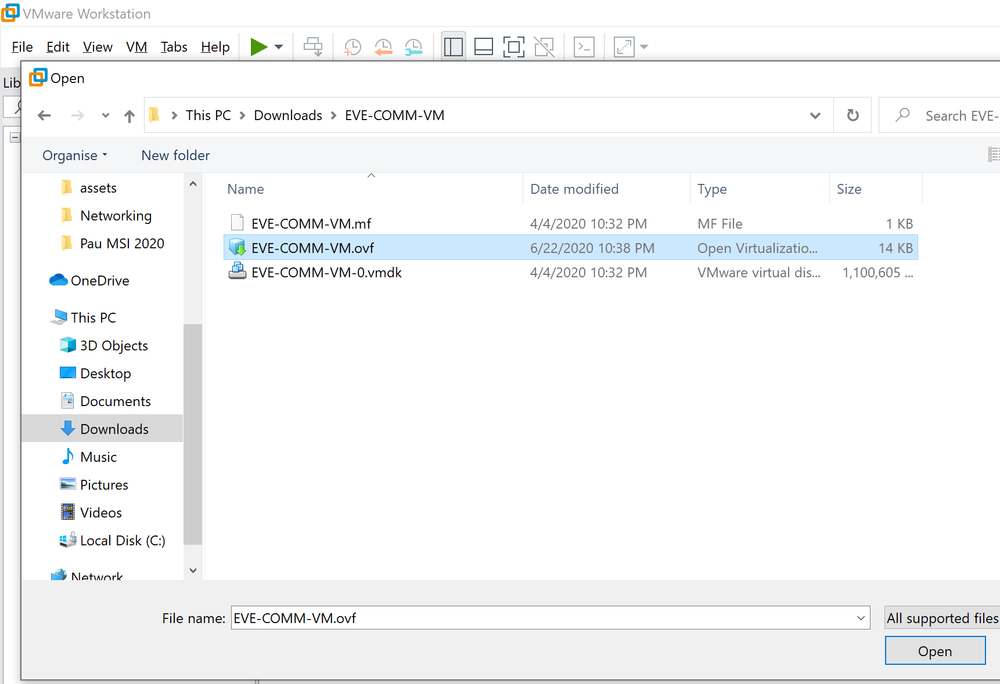
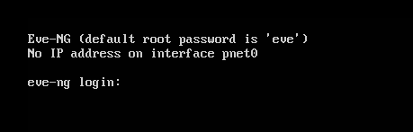
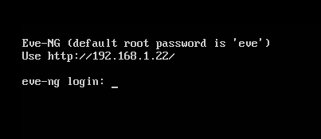
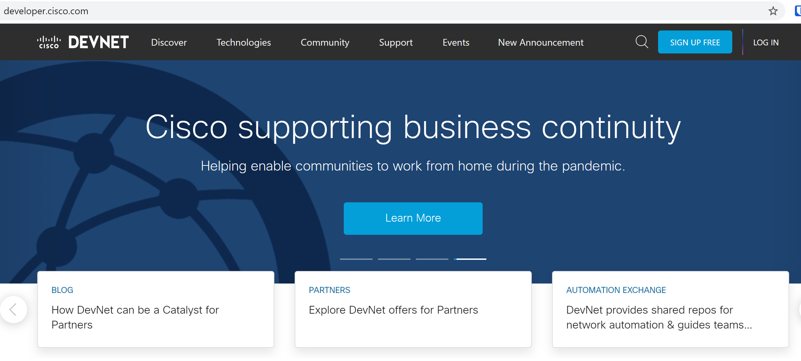
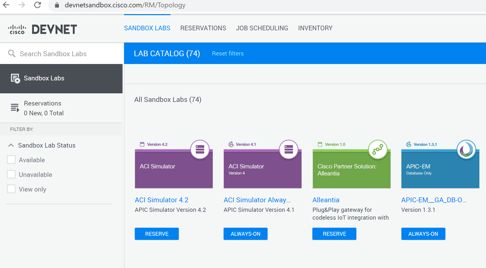
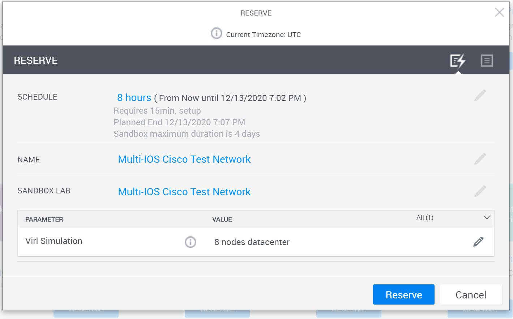
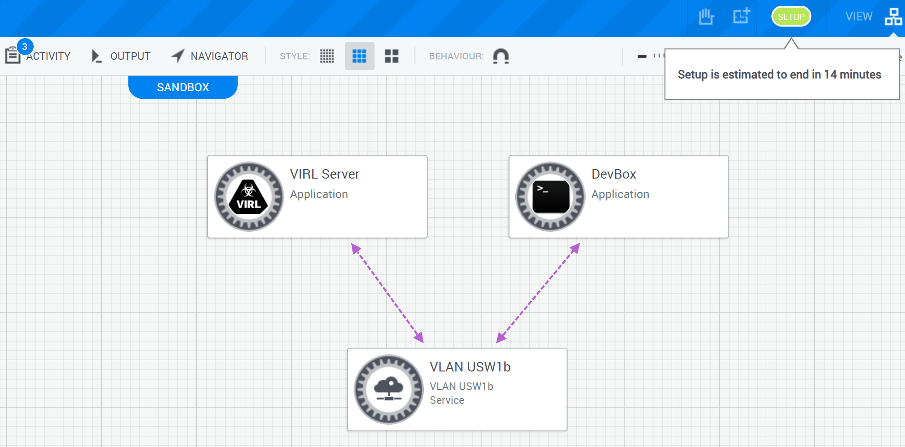
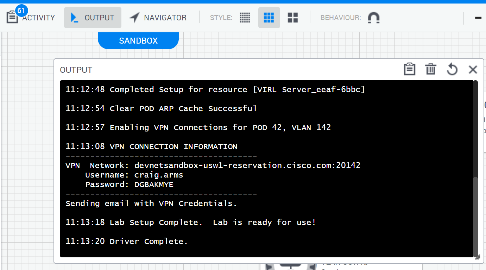

# Outils de Labbing

L'objectif du TP est de pratiquer le plus possible sur des environements proche de ce qu'on peut voir en production. Pour cela nous utiliserons un des outils ci-dessous afin d'émuler les plateformes réseaux.

Ces outils permettent:
 * L'orchestration:
	* d'hyperviseur
		* Dynamips
		* QEMU
		* VMware
		* Hyper-V
		* VirtualBox
	* de conteneur
		* Docker
	* des liaisons réseaux entre les éléments orchestrés
 * L'execution de Binaires
 * La capture de trafic

## GNS3 

Initialement une interface graphique pour gérer l'outil d'emulation de plateforme MIPS: dynamips. Aujourd'hui GNS3 est une interface graphique et un orchestrateur de réseaux de test incontournable.

Il est composé d'une interface graphique compatible multiplateform, et d'un écosystème d'émulation et de virtualisation.

Dans sa version Out-Of-the-Box GNS3 propose toujours de gérer des images IOS (Cisco) basées sur les processeurs MIPS. Dynamips sera exécuté localement avec l'interface graphique. (Serveur Local).

Pour étendre les fonctionnailtés et permettre l'utilisation de machines virtuelles, de conteneur et de binaires réseaux il faudra s'appuyer sur un système Linux supportant une partie GNS3 serveur qui sera capable de gérer des environements plus complexes.

### Installation

La partie interface graphique se télécharge sur [gns3.com](http://gns3.com) ou directement dans les releases du [repo github](https://github.com/GNS3/gns3-gui/releases).

GNS3 met aussi à disposition une VM Linux préalablement configuré pour gérer les environements complexes: la VM GNS3
Téléchargeable elle aussi sur le [repo github](https://github.com/GNS3/gns3-gui/releases)

**Attention**: les versions d'interface graphique et de GNS3 VM doivent être strictement identique (au moment d'écriture).

Téléchargez la version de VM adapté au système de virtualisation que vous utilisez sur votre poste de travail.

*Notez qu'il n'est pas nécessaire que la VM soit sur le même hôte que l'interface graphique, seul la connectivité IP, HTTP est nécessaire entre les environements. Vous pourriez par exemple déployer la VM GNS3 dans un cloud public comme Google, Azure ou AWS*

*La VM GNS3 n'est qu'un système Ubuntu avec des scripts helper et des dossiers préconfigurés*

### Configuration: VM Première connexion

Une fois la VM GNS3 installé vous serez accueillit avec un écran d'information

Il sera important de noter si le champ **KVM support available** est à True. Sous VMware Workstation l'option permettant cela fait référence à *Intel VT*

### Configuration: GNS3 Premier Lancement

Au premier lancement de GNS3, un wizard proposera 3 solutions

Les options permettent:
 * D'utiliser la VM GNS3, l'interface graphique sera capable de démarer la VM au lancement, récupérer les informations de connectivité, et de l'éteindre à la fermeture de l'interface.
 * L'option PC Local seul ne permet que l'emulation avec Dynamips ce qui limite fortement l'environement que l'on peut simuler
 * La dernière option est a utiliser quand on a déporté l'installation du serveur GNS3, sur un même réseau, sur un cloud public, ou bien de l'autre coté d'un VPN.
 
On pourra plutard modifier la configuration du client afin d'utiliser un mix des 3 solutions proposées.

En accèdant au menu *Edit > Settings > GNS3 VM* on peut constater la bonne detection de l'outil de virtualisation ainsi que la VM déployée. Ici VMware Workstation avec une VM nommée "GNS3 VM 2.2.15"

La bonne santé de la configuration se voit dans le panel *Server Summary*

## EVE-NG 

EVE-NG est né de l'évolution d'outils graphique pour gérer les binaires IOU/IOL (IOS On Unix/IOS On Linux) qui ont été diffusé sur internet au début des années 2010, la différence majeur entre EVE-NG et les autres outils de se catégorie est l'absence de client "lourd" et la concentration du développment sur l'interface web uniquement.

EVE-NG se présente sous la forme d'une machine virtuelle, basée sur un système Ubuntu, préconfigurée avec des environements d'émulation de de virtualisation.

De prima bord, la prise en main d'EVE-NG peut paraitre plus simple du fait qu'il suffise de lancer une VM et de se connecter à l'interface Web. Il faudra cependant avoir de bonne connaissance Linux (ou beaucoup de patience et de recherche Google) pour créer des environements complexes.

La version gratuite d'EVE-NG ne supporte pas l'intégration de conteneur dans les topologies, et ne permet l'utilisation d'un seul Lab à la fois.

### Installation

La VM EVE-NG se télécharge sur [eve-ng.com](http://eve-ng.com), elle existe sous le format OVF (Open Virtualisation File) et sous le format ISO.

Nous préférerons le format *appliance* OVF qui permettra une importation simplifié dans VMware.

Après avoir extrait l'archive d'EVE-NG, il suffit d'importer/d'ouvrir le fichier OVF avec VMware.

### Configuration

Après le premier lancement de la VM EVE-NG vous serez accueillit avec un prompt de login similaire à celui ci dessous.

Loggez vous et suivez le wizard de configuration, par défaut l'appliance est configuré pour être ponté avec votre carte réseau.

*Attention il arrive que VMware ponte vos VM sur une mauvaise carte réseau: filaire alors que vous êtes en Wifi ou l'inverse, il peut être intéressant de basculer sur un réseau Natté afin d'éviter ce type de scénario s'il se produit*

Vous pouvez maintenant accèder à EVE-NG via votre naviguateur. (username: admin / password: eve)

![eve logon][../assets/eve_logon.png)

## Cisco VIRL 

Cisco VIRL est similaire d'un point de vue technologique à GNS3 et EVE-NG, à la différence prêt que c'est le seul des 3 à être supporté par un vendor. La plateforme est compatible avec toutes les VM de type KVM/QEMU et donc permettra non-seulement d'émuler des systèmes Cisco mais aussi des systèmes concurent.

Cisco VIRL est un produit vendu pour les organisations ayant des besoins de bac-à-sable, dans le cadre de CI/CD Network, de PoC client, ou juste en vielle technologique pour les experts réseaux.

Cisco VIRL peut être acheté en mode aaS où en mode on-prem, dans lequel cas il faudra un serveur bare-metal pour le mettre en place.

Dans le cadre de son programme DevNet, Cisco met à disposition des cours ainsi que des LAB/TP/Bac-à-sable gratuitement et reservable sur le site [developer.cisco.com](http://developer.cisco.com)

*Nous préfèrerons cette dernière approche dans le cadre du TP*

### Reservation du lab

Après vous être loggué ou inscrit sur le site du DevNet, rendez vous dans la section **Discover > Sandbox Remote Labs**, ici vous trouverez tous les lab utilisables. Certain requièrent une réservation (souvent instantanée) d'autres sont *always-on*.

Le Lab permettant m'utilisation de Cisco VIRL se nomme **Multi-IOS Cisco Test Network**, reservez le pour la période souhaité.

### Lab Setup et accès

Une fois votre Lab reservé, ou l'horaire de votre reservation atteint, vous aurez accès à la page de topology et d'information sur celui ci

Pendant qu'il se configure/deploie profitez en pour consulter la documentation dans le panneau de gauche.

L'accès au Lab s'effectuera par VPN Cisco AnyConnect, le client devra donc être installé. Les informations de connexion vous seront attribué dynamiquement lors du déploiement et seront disponible dans le panneau **Output** du Lab; ils vous seront aussi envoyé par email.

