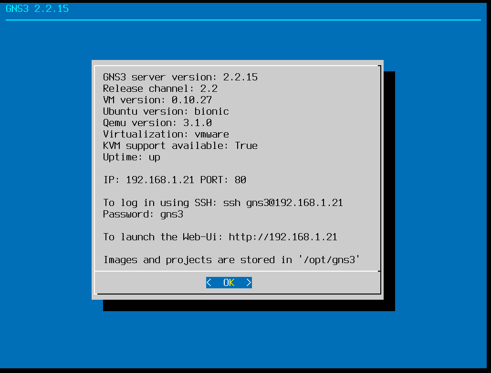
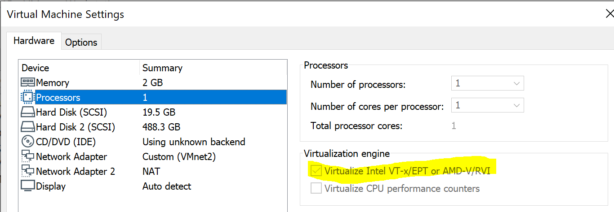
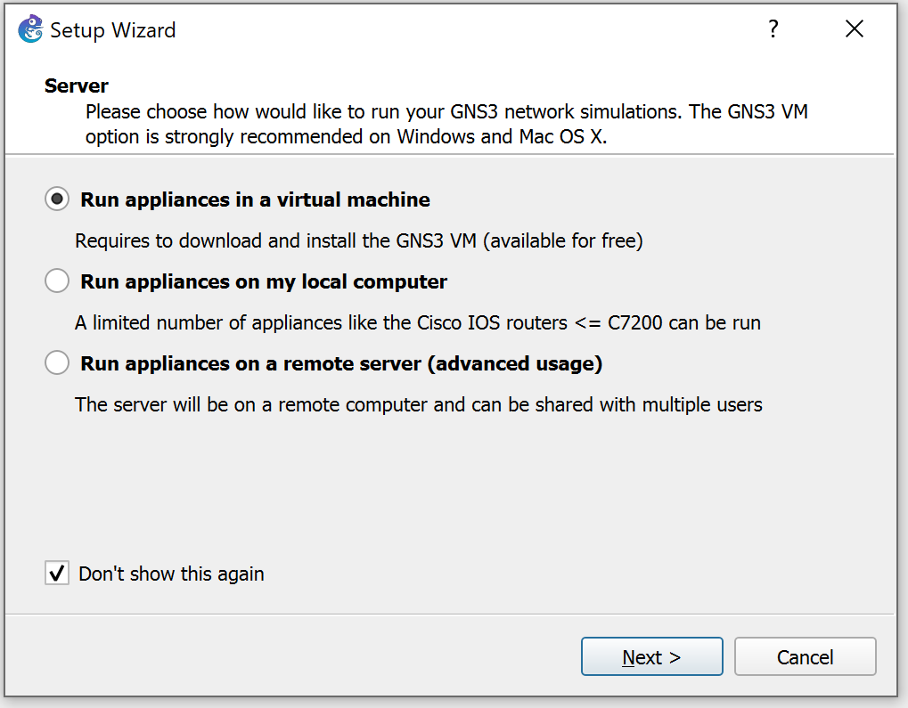
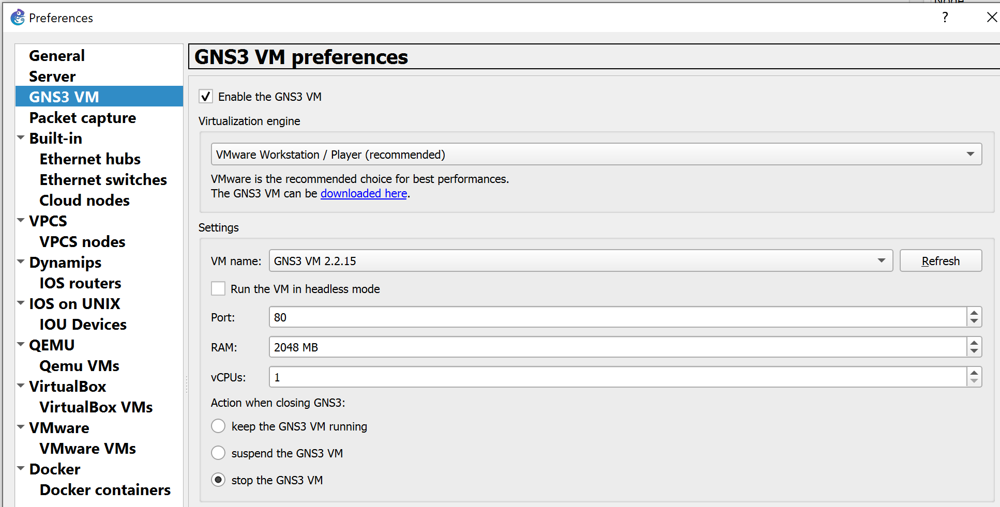
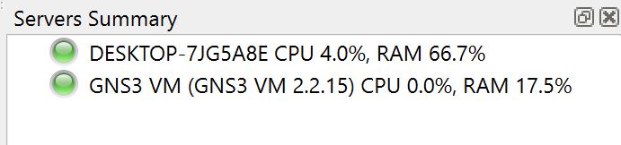

# Outils de Labbing

L'objectif du TP est de pratiquer le plus possible sur des environements proche de ce qu'on peut voir en production. Pour cela nous utiliserons un des outils ci-dessous afin d'émuler les plateformes réseaux.

Ces outils permettent:
 * L'orchestration:
	* d'hyperviseur
		* Dynamips
		* QEMU
		* VMware
		* Hyper-V
		* VirtualBox
	* de conteneur
		* Docker
	* des liaisons réseaux entre les éléments orchestrés
 * L'execution de Binaires
 * La capture de trafic

## GNS3 

Initialement une interface graphique pour gérer l'outil d'emulation de plateforme MIPS: dynamips. Aujourd'hui GNS3 est une interface graphique et un orchestrateur de réseaux de test incontournable.

Il est composé d'une interface graphique compatible multiplateform, et d'un écosystème d'émulation et de virtualisation.

Dans sa version Out-Of-the-Box GNS3 propose toujours de gérer des images IOS (Cisco) basées sur les processeurs MIPS. Dynamips sera exécuté localement avec l'interface graphique. (Serveur Local).

Pour étendre les fonctionnailtés et permettre l'utilisation de machines virtuelles, de conteneur et de binaires réseaux il faudra s'appuyer sur un système Linux supportant une partie GNS3 serveur qui sera capable de gérer des environements plus complexes.

### Installation

La partie interface graphique se télécharge sur [gns3.com](http://gns3.com) ou directement dans les releases du [repo github](https://github.com/GNS3/gns3-gui/releases).

GNS3 met aussi à disposition une VM Linux préalablement configuré pour gérer les environements complexes: la VM GNS3
Téléchargeable elle aussi sur le [repo github](https://github.com/GNS3/gns3-gui/releases)

**Attention**: les versions d'interface graphique et de GNS3 VM doivent être strictement identique (au moment d'écriture).

Téléchargez la version de VM adapté au système de virtualisation que vous utilisez sur votre poste de travail.

*Notez qu'il n'est pas nécessaire que la VM soit sur le même hôte que l'interface graphique, seul la connectivité IP, HTTP est nécessaire entre les environements. Vous pourriez par exemple déployer la VM GNS3 dans un cloud public comme Google, Azure ou AWS*

*La VM GNS3 n'est qu'un système Ubuntu avec des scripts helper et des dossiers préconfigurés*

### Configuration: VM Première connexion

Une fois la VM GNS3 installé vous serez accueillit avec un écran d'information

Il sera important de noter si le champ **KVM support available** est à True. Sous VMware Workstation l'option permettant cela fait référence à *Intel VT*

### Configuration: GNS3 Premier Lancement

Au premier lancement de GNS3, un wizard proposera 3 solutions

Les options permettent:
 * D'utiliser la VM GNS3, l'interface graphique sera capable de démarer la VM au lancement, récupérer les informations de connectivité, et de l'éteindre à la fermeture de l'interface.
 * L'option PC Local seul ne permet que l'emulation avec Dynamips ce qui limite fortement l'environement que l'on peut simuler
 * La dernière option est a utiliser quand on a déporté l'installation du serveur GNS3, sur un même réseau, sur un cloud public, ou bien de l'autre coté d'un VPN.
 
On pourra plutard modifier la configuration du client afin d'utiliser un mix des 3 solutions proposées.

En accèdant au menu *Edit > Settings > GNS3 VM* on peut constater la bonne detection de l'outil de virtualisation ainsi que la VM déployée. Ici VMware Workstation avec une VM nommée "GNS3 VM 2.2.15"

La bonne santé de la configuration se voit dans le panel *Server Summary*

## EVE-NG

## Cisco VIRL