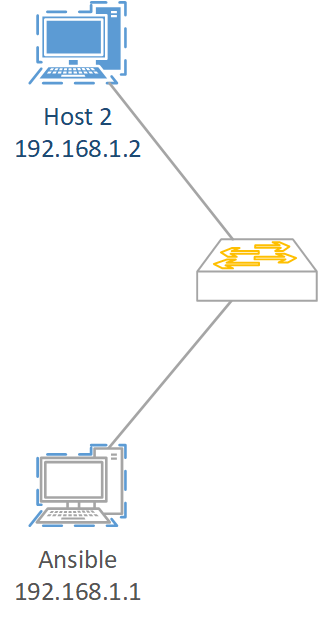
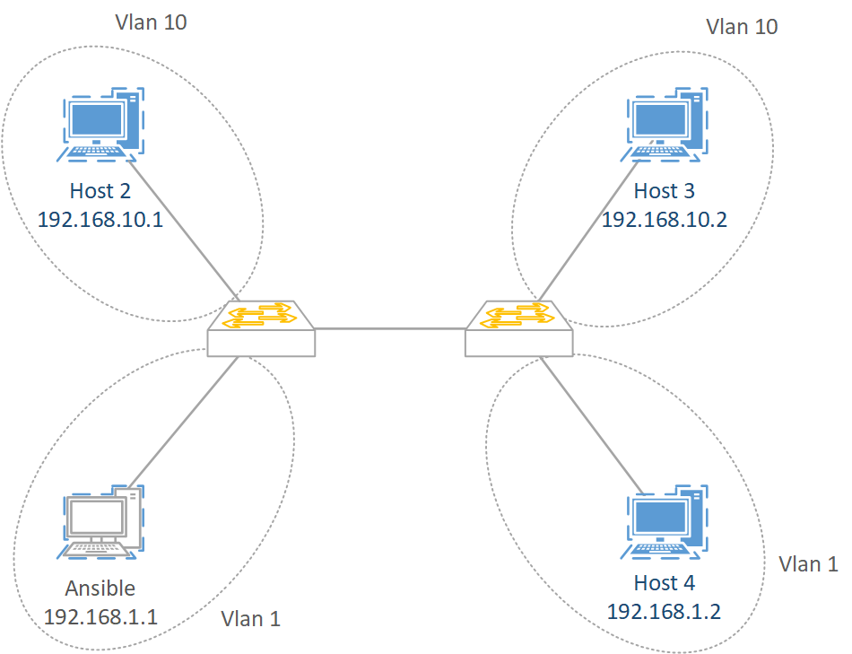

# Collapsed Core: LAN batiment unique
## Switching

L'objectif de cette section est de configurer et vérifier le fonctionement d'un réseau LAN d'entreprise.

Pour démarrer cette section vous configurerez un switch avec 2 hôtes et testerez le bon fonctionement.

[Configurez](../1.env_setup/ansible_validation.md#configuration-de-lip) l'IP de l'hôte Ansible avec les valeurs par défaut

[Configurez](../1.env_setup/ansible_validation.md#configuration-de-lip) l'IP de l'hôte 2 avec les valeurs : VLAN = 1 et HOST = 2

[Validez](../1.env_setup/ansible_validation.md#playbooks) la réussite de cette section avec le playbook 002

## Segmentation des domaines de diffusion: VLAN
### VLAN & Table CAM

L'objectif de cette section est de segmenter le domaine de diffusion unique de la section précédente en multiple domaines grâce aux VLANs

[Reconfigurez](../1.env_setup/ansible_validation.md#configuration-de-lip) l'IP de l'hôte 2 avec les valeurs : VLAN = 10 et HOST = 1

[Configurez](../1.env_setup/ansible_validation.md#configuration-de-lip) l'IP de l'hôte 3 avec les valeurs : VLAN = 10 et HOST = 2

[Configurez](../1.env_setup/ansible_validation.md#configuration-de-lip) l'IP de l'hôte 2 avec les valeurs : VLAN = 1 et HOST = 2

[Validez](../1.env_setup/ansible_validation.md#playbooks) la réussite de cette section avec le playbook 003 sur l'hôte Ansible et l'hôte 2

### VLAN Switching: Tags, Trunks, 802.1q

L'objectif de cette section est d'étendre la segmentation à un autre switch, et donc t'étendre le LAN sans perdre le bénéfice des Vlans.

### VLANs: VTP, DTP
## Redondance des liaisons
### Spanning-Tree
### Etherchannels
## Routage Inter-Vlan
### Router on a stick
### Layer 3 switch
## Securisation des réseaux
### ACLs
### MACLs
### VACLs
### Creation d'une DMZ