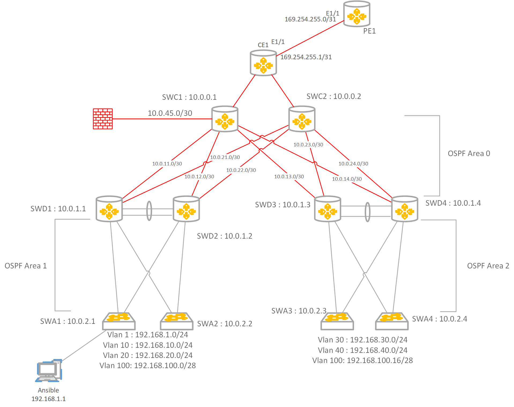

# Enterprise WAN: Se connecter à l'extérieur
## Routage par défaut
L'objectif de cette section est de fournir un accès vers l'extérieur au réseau Campus.

Pour démarrer cette section rajouter un routeur CE (Customer Edge) au dessus des équipements Core, ce routeur va représenter un équipment fourni par un FAI.

Dans ce réseau nous allons utiliser la plage [APIPA](https://www.rfc-editor.org/rfc/rfc3927.html) pour réprésenter des adresses IP Publiques (169.254.0.0/16).

Le routeur CE aura des interfaces LAN configurées en IP Privé et une Interface Publique configuré avec un IP de la plage APIPA.

Ajoutez un second routeur PE1 qui représentera le Provider Edge, le premier saut de votre fournisseur. Configurez le avec une IP APIPA.

Configurez une route statique par défaut, sur le CE vers le PE1

Propagez cette route par défaut dans le protocol de routage OSPF.

L'hote Ansible dans le Vlan 1 peut il pinger l'adresse IP "Publique" du CE ?

Peut il pinger l'adresse IP "Publique" du PE1 ?

## Trasnlation d'adresses: NAT
