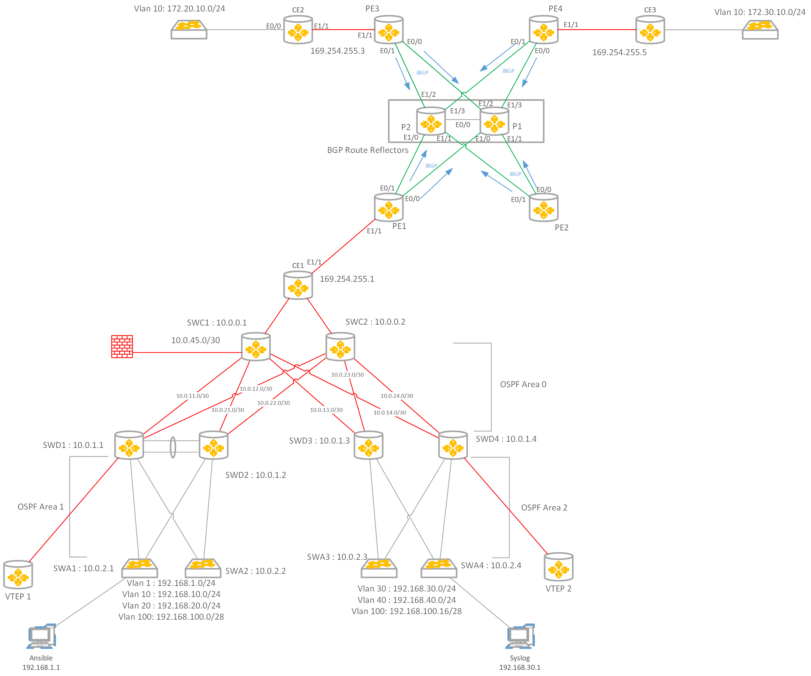

# TP Networking

## Introduction

Ce repository Git contient les TPs dont je me sers pour animer les cours de réseaux. 
Une connaissance de base de la virtualisation est nécessaire afin de mettre en place et se connecter à l'environement
GNS3 et/ou EVE-NG. L'environement Cisco VIRL nécessite le client VPN Cisco Anyconnect ainsi que la réservation d'un lab VIRL
sur la plateforme developer.cisco.com (free).

Les TP sont fortement orienté technologies Cisco mais les connaissances sont transposables aux autres vendors, le choix
technologique de ces labs est fait en fonction des contraintes des apprenants (puissance compute limitée).

Difficulté des TP par thémes:
* Réseaux: Moyen à Expert
* Linux: Débutant à Moyen
* Virtualisation: Débutant
* Docker: Débutant à Moyen
* Ansible: Débutant à Moyen

D'autres thèmes en cours d'écriture sont:
* CI/CD Network as Code Pipeline
* Streamline Troubleshooting avec MQTT, LibreNMS & Ansible

## Prérequis

Il faut s'équiper de Notepad++ ainsi qu'un outil de tab pour session SSH pour pas perdre la tête.

Notepad++ peut être rendu plus joli avec le fichier de [langage Cisco](assets/npp_cisco_ios.xml)

## Diagram du réseau cible

## Sommaire

1. Mise en place de l'environement  
	1. [Outils de labbing](1.env_setup/labbing_tools.md)
		1. [GNS3](1.env_setup/labbing_tools.md#gns3)
		2. [EVE-NG](1.env_setup/labbing_tools.md#eve-ng)
		3. [Cisco Virl](1.env_setup/labbing_tools.md#cisco-virl)
		
	2. [Images de simulation](1.env_setup/device_images.md)
		1. [IOSv](1.env_setup/device_images.md#iosv)
		2. [IOL](1.env_setup/device_images.md#iol)
		3. [Docker](1.env_setup/device_images.md#conteneurs-docker)
		4. [Fortigate](1.env_setup/device_images.md#fortigate)
		5. [FRRouting](1.env_setup/device_images.md#frrouting)
		6. [Open vSwitch](1.env_setup/device_images.md#open-vswitch)
		
	3. [Conteneur docker](1.env_setup/docker_briefing.md)
		1. [Interfaces et réseaux Docker](1.env_setup/docker_briefing.md#interface-et-reseaux-docker)
		2. [Traitement des réseaux docker avec GNS3](1.env_setup/docker_briefing.md#traitement-des-reseaux-docker-avec-gns3)
		3. [Traitement des réseaux docker avec EVE-NG](1.env_setup/docker_briefing.md#traitement-des-reseaux-docker-avec-eve-ng)
		4. [Conteneur de service lab: Fake server; Ansible](1.env_setup/docker_briefing.md#conteneur-de-service-lab-fake-server-ansible)
		
2. [Service d'auto-validation](1.env_setup/ansible_validation.md)

3. Campus LAN  

	1. [Collapsed Core: LAN batiment unique](2.campus_lan/collapsed_core.md)
		1. [Switching](2.campus_lan/collapsed_core.md#switching) 
		2. [Segmentation des domaines de diffusion: VLAN](2.campus_lan/collapsed_core.md#vlans) 
			1. [VLAN & Table CAM](2.campus_lan/collapsed_core.md#vlans)
			2. [VLAN Switching: Tags, Trunks, 802.1q](2.campus_lan/collapsed_core.md#trunking)
			3. [VLANs: VTP, DTP](2.campus_lan/collapsed_core.md#vtp_dtp)
		3. [Redondance des liaisons](2.campus_lan/collapsed_core.md#redundancy) 
			1. [Spanning-Tree](2.campus_lan/collapsed_core.md#spanning-tree) 
			2. [Etherchannels](2.campus_lan/collapsed_core.md#etherchannel) 
		4. [Routage Inter-Vlan](2.campus_lan/collapsed_core.md#inter-vlan-routing)
			1. [Router on a stick](2.campus_lan/collapsed_core.md#router-on-a-stick) 
			2. [Layer 3 switch](2.campus_lan/collapsed_core.md#l3-switching)
		5. [Securisation des passerelles](2.campus_lan/collapsed_core.md#fhrp)
			1. HSRP
			2. VRRP
			3. GLBP
		6. [Securisation des réseaux](2.campus_lan/collapsed_core.md#vlan-security)
			1. [ACLs](2.campus_lan/collapsed_core.md#acl) 
			2. [MACLs](2.campus_lan/collapsed_core.md#macl) 
			3. [VACLs](2.campus_lan/collapsed_core.md#vacl) 
			4. [Creation d'une DMZ](2.campus_lan/collapsed_core.md#dmz) 

	2. Tier-network: Campus Multi-batiment
		1. Network Core
		3. Static Routing
		3. Dynamic Routing
			1. RIP
			2. EIGRP
			3. OSPF Multi-area
		4. Securisation des réseaux
		5. VxLAN & DMZ Optimization

4. Enterprise WAN  
	1. [Connectivité exterieur: default route, NAT](3.entreprise_wan/exterior_connectivity.md#enterprise-wan-se-connecter-a-l-exterieur)
	2. Connectivité multi-site
		1. Tunnel GRE
		2. DMVPN
		3. Chiffrement des Flux
		4. L2TPv3
		5. MPLS/MP-BGP

5. Network services  
	1. Syslog/ Splunk
	2. LibreNMS or Zabbix
	3. Netdisco
	4. Guacamole Network Bastion
	5. Ansible

6. Network Automation  
	1. Ecriture de playbook:
		1. Sauvegarde des configurations
		2. Gestion de VLAN
	2. Introduction à Ansible Semaphore

